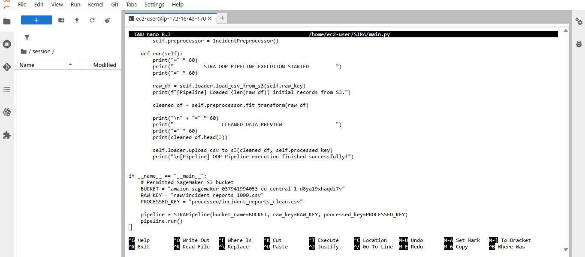

SIRA - Incident Report Data Pipeline & Analysis
Overview
SIRA is a modular data engineering and exploratory analytics pipeline designed to clean, structure, and analyze raw operational incident logs. By converting unstructured incident descriptions and corrupted fields into sanitized, high-quality tabular datasets, SIRA lays the groundwork for downstream predictive modeling and machine learning workflows.

Key Objectives
Data Cleaning & Preprocessing: Audit raw incident logs, handle missing/corrupted values, and standardize timestamps and text records.

Modular Engineering: Structure core functionality into reusable Python modules (src/) distinct from interactive exploration notebooks (notebooks/).

Cloud & Machine Learning Readiness: Prepare structured, analytics-ready datasets for interactive dashboards and cloud-hosted ML model pipelines.

Repository Structure
Plaintext
SIRA/
├── data/                  # Raw and processed datasets
│   ├── raw/               # Original incident logs
│   └── processed/         # Cleaned and standardized data
├── notebooks/             # Exploratory Data Analysis (EDA) notebooks
├── src/                   # Source code and modular Python packages
│   ├── data_loader.py     # Data loading utilities
│   └── explorer.py        # DataExplorer class for cleaning & auditing
├── .gitignore             # Git exclusion rules
├── README.md              # Project documentation
└── requirements.txt       # Project dependencies

Exploratory Data Analysis & Verification

Below is the execution output from the data cleanliness audit:

