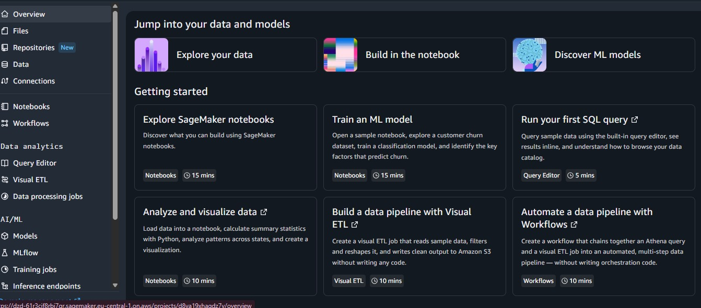

SIRA - Incident Report Data Pipeline & Analysis
Overview
SIRA is a modular data engineering and exploratory analytics pipeline designed to clean, structure, and analyze raw operational incident logs. By converting unstructured incident descriptions and corrupted fields into sanitized, high-quality tabular datasets, SIRA lays the groundwork for downstream predictive modeling and machine learning workflows.

Key Objectives
Data Cleaning & Preprocessing: Audit raw incident logs, handle missing/corrupted values, and standardize timestamps and text records.

Modular Engineering: Structure core functionality into reusable Python modules (src/) distinct from interactive exploration notebooks (notebooks/).

Cloud & Machine Learning Readiness: Prepare structured, analytics-ready datasets for interactive dashboards and cloud-hosted ML model pipelines.

Repository Structure

SIRA/
├── assets/                # Screenshot artifacts & documentation images
│   └── eda_audit.jpeg     # Execution output screenshot
├── data/                  # Raw and processed datasets
│   ├── raw/               # Original incident logs
│   └── processed/         # Cleaned and standardized data
├── notebooks/             # Exploratory Data Analysis (EDA) notebooks
├── src/                   # Source code and modular Python packages
│   ├── data_loader.py     # Data loading utilities
│   └── explorer.py        # DataExplorer class for cleaning & auditing
├── .gitignore             # Git exclusion rules
├── README.md              # Project documentation
└── requirements.txt       # Project dependencies

Local vs. AWS Environment Comparison

Storage Layer
Local Workstation (VS Code): Relies on local disk storage (such as data/raw/).

Cloud Environment (AWS): Uses Amazon S3 object storage (s3://.../raw/).

Compute Power
Local Workstation (VS Code): Bounded by the local machine's physical CPU and RAM limits.

Cloud Environment (AWS): Powered by scalable, on-demand SageMaker EC2 instances.

Code Execution
Local Workstation (VS Code): Runs directly on the local Python runtime.

Cloud Environment (AWS): Managed within cloud-hosted SageMaker JupyterLab environments.

Data Persistence
Local Workstation (VS Code): Vulnerable to data loss if local hardware or drives fail.

Cloud Environment (AWS): Highly available, durable storage isolated across S3 object repositories.

Security & Access Control
Local Workstation (VS Code): Managed via local operating system file permissions.

Cloud Environment (AWS): Governed by fine-grained AWS IAM roles and least-privilege policies.

IAM & Security Considerations
Role-Based Access Control (RBAC): SageMaker JupyterLab attaches an IAM execution role to authorize S3 bucket reads/writes without exposing static credentials.

Credential Hygiene: No access keys (AWS_ACCESS_KEY_ID or AWS_SECRET_ACCESS_KEY) are hardcoded into source code or committed to GitHub.

Storage Encryption: AWS S3 buckets enforce Server-Side Encryption (SSE-S3) to safeguard datasets at rest.

Cost Considerations
Amazon S3 Storage: Minimal cost based on gigabyte-per-month object storage and GET/PUT API call volumes.

SageMaker Compute: Incurs hourly charges based on the instance type; cost is optimized by stopping the SageMaker instance when idle.

Data Transfer: In-region data transfers between S3 and SageMaker within the same AWS region incur zero bandwidth fees.

Below is the execution output from the data cleanliness audit:

Reflection Questions

Question 1: Why did we move SIRA from a local environment to AWS?

Migrating SIRA to AWS transitions the application from a restricted local workstation to a scalable, cloud-native architecture. Local setups are inherently limited by physical hardware, localized storage capacity, and isolated execution contexts. Transitioning to AWS provides on-demand compute elasticity, centralized and highly available object storage via Amazon S3, seamless integration with managed cloud machine learning environments (SageMaker), and enterprise-grade security and automated disaster recovery.

Question 2: What role does S3 play in the SIRA architecture?

Amazon S3 (Simple Storage Service) serves as the centralized, persistent object storage layer for the SIRA data architecture. It decoupled data storage from compute resources by hosting raw incident logs (raw/incident_reports.csv) prior to ingestion and storing transformed, analytics-ready datasets (processed/) output by the pipeline. This ensures data persistence across variable compute lifecycles.

Question 3: What role does SageMaker JupyterLab play?

AWS SageMaker JupyterLab functions as the cloud-hosted integrated development environment (IDE) and execution runtime (/home/ec2-user/SIRA). Pre-configured with Linux kernels, Python runtimes, data science libraries, and native AWS SDK integration via IAM role delegation, it enables efficient modular script execution, exploratory data analysis (EDA), and remote Git repository version control.

Question 4: What is the difference between S3 and EBS?

Amazon S3 (Simple Storage Service): A serverless, globally accessible object storage service designed for unstructured and semi-structured data (e.g., CSV files, media, and model artifacts). Access is managed via HTTP API requests or the boto3 SDK independently of running compute nodes.

Amazon EBS (Elastic Block Store): High-performance block storage attached directly to a specific EC2 or SageMaker compute instance (functioning similarly to a virtual hard drive). EBS persists operating system files, runtime environment dependencies, and active workspace files (/home/ec2-user/SIRA), accessible only by the attached compute node.

Question 5: Why do we need IAM?

AWS Identity and Access Management (IAM) governs authentication and fine-grained authorization across cloud resources. Adhering to the principle of least privilege, IAM policies and roles grant specific services (e.g., SageMaker JupyterLab) explicit permissions to interact with target resources (e.g., designated S3 buckets) without hardcoding long-term API access credentials directly within application source code.

Question 6: What would happen if you deleted your local dataset but the dataset was still available in S3?

Deleting local file copies has zero impact on pipeline functionality. SIRA’s DataLoader class abstracts data access by streaming datasets directly from Amazon S3 (s3://.../raw/incident_reports.csv) into active memory (Pandas DataFrames) via boto3. S3 functions as the single source of truth, rendering local data caching optional.

Question 7: What challenges did you encounter during migration?

Dynamic Path Resolution: Overcoming directory path mismatches (ModuleNotFoundError) when executing sub-folder notebooks (notebooks/) relative to root-level Python scripts.

Environment Synchronization: Standardizing environment configurations and relative import logic across local VS Code and cloud SageMaker environments.

Asset & Path Verification: Correcting case-sensitive documentation asset links (.jpeg vs. .png) to ensure visual evidence artifacts rendered accurately on GitHub.

Question 8: If SIRA had 1 million incident reports instead of 1,000, what aspects of the architecture would need to change?

Distributed Data Processing: Upgrading from in-memory Pandas processing to distributed computing engines such as PySpark running on AWS EMR or serverless AWS Glue.

Storage Optimization: Converting flat CSV files in S3 into partitioned, columnar, compressed formats (such as Apache Parquet) to optimize query latency and minimize scan costs.

Data Warehousing: Ingesting processed outputs into an indexed database or cloud data warehouse (such as Amazon Redshift or Amazon DynamoDB) for high-throughput querying.

Question 9: If multiple developers were working on SIRA, what AWS services or practices could help with collaboration and security?

Version Control Strategy: Establishing feature-branch workflows, pull request policies, and automated branch protection on GitHub or AWS CodeCommit.

Identity Governance: Implementing federated SSO and individual IAM roles mapped to specific developer responsibilities rather than shared access keys.

Secrets Management & Encryption: Enforcing server-side encryption via AWS KMS and storing sensitive API configuration tokens in AWS Secrets Manager.

Shared Workspaces: Utilizing SageMaker Shared Spaces and centralized S3 bucket policies for collaborative notebook development.

Question 10: What part of the SIRA application would you move to a managed ML service such as SageMaker, and why?

The Feature Engineering & ML Training/Inference Pipeline should be offloaded to dedicated SageMaker managed services, specifically SageMaker Training Jobs and SageMaker Endpoints.

Rationale: Decoupling model training and model hosting from interactive JupyterLab environments enables automated hyperparameter tuning, managed model versioning via SageMaker Model Registry, auto-scaling real-time API endpoints, and automated drift monitoring without overloading local notebook compute resources.